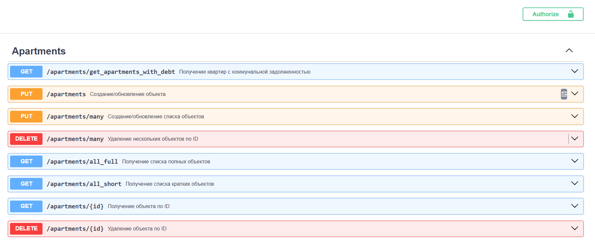
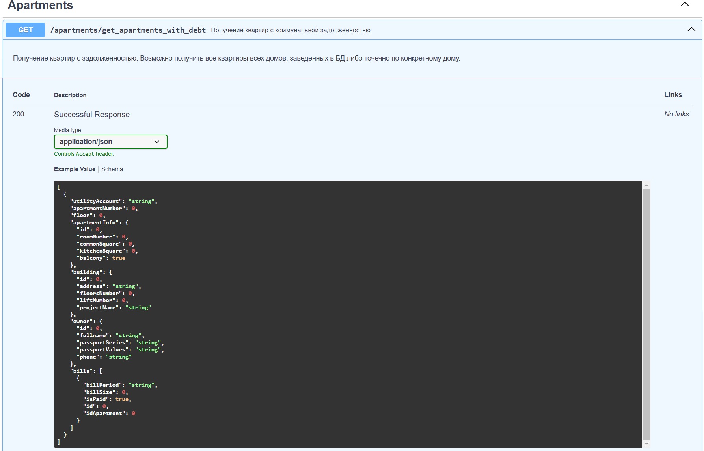
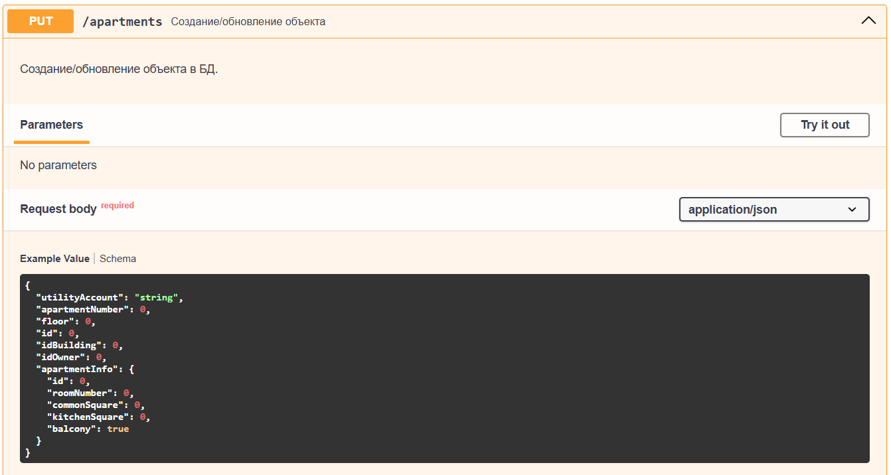
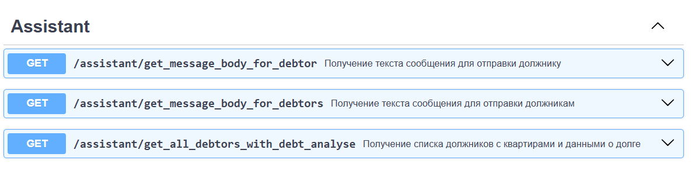
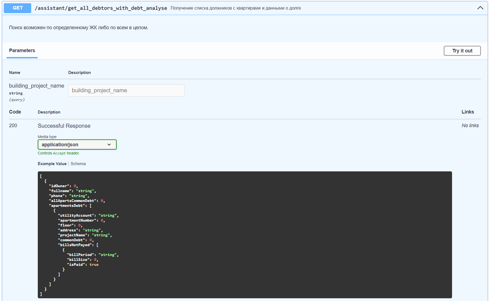

### Проверка линтером и аннотатором типов:
```
python -m flake8 . --config=tox.ini
python -m mypy src --config-file mypy.ini
```

### Команды для миграций:
```
alembic init alembic
alembic revision --autogenerate -m "add user table"
alembic upgrade head
```

Backlog: <br>
- [x] пофиксить обработчик ошибок;
- [ ] прописать status_code в эндпойнтах роутеров для ошибок;
- [ ] добавить шедуллер для формирования выборки должников и генерации им уведомлений;
- [ ] добавить github-ci.yml
- [x] добавить телеграмм бота;
- [ ] нагенерировать синтетических данных в БД и обучить на них LR | CatBoost и для обученной модели реализовать микросервис предсказания задолженности по месяцам и собственникам.

## Управление ЖК: <br>
### Система мониторинга коммунальных задолженностей для управляющих компаний.<br>
<br>

Проект представляет API-интерфейс для взаимодействия с базой данных.<br>

### Основные функции:
- Общие CRUD методы с использованием базового репозитория, контроллера и роутера.
- Аналитика задолженности: Методы API для получения подробной аналитики по неоплаченным счетам.<br>
- Генерация уведомлений: Функция формирования автоматизированных текстовых уведомлений для должников.<br>

### Структура базы данных:

Система использует реляционную базу данных, содержащую следующие таблицы:

- apartment: информация о квартирах;
- apartment_info: дополнительные сведения о квартирах;
- building: данные о здании, к которому относится квартира;
- owner: информация о владельцах квартир;
- bills: записи о коммунальных платежах с флагом оплачено/не оплачено.
- users: данные о пользователях для авторизации.

### Используемый стек технологий:
- fastapi
- SQLAlchemy ORM,
- alembic,
- redis
- aiogram


## Пример отображения базовых crud методов на примере apartments (кроме первого):


### Специальный метод получения полной информации о квартире (селект в БД через relationships):


### Put метод создания/обновления - единый метод для создания либо обновления.<br>
Если объект новый, id=0, иначе нужно передать корректный id.<br>
Метод создает/обновляет данные сразу в 2 таблицах - apartment и apartment_info через реализованные relationship.


## Роутер Assistant - уникальные методы для аналитики и помощи в контроле своевременности оплат.


### Метод поиска владельцев с наличие задолженности по квартире.
У человека может быть более 1 квартиры, в связи с чем в apartmnetsDebt отображается список всех квартир с задолженностью,
а на верхнем уровне есть параметр итоговой задолженности по всем квартирам и внутри каждой квартиры есть общая сумма задолженности,
список должников сортируется по убыванию.
